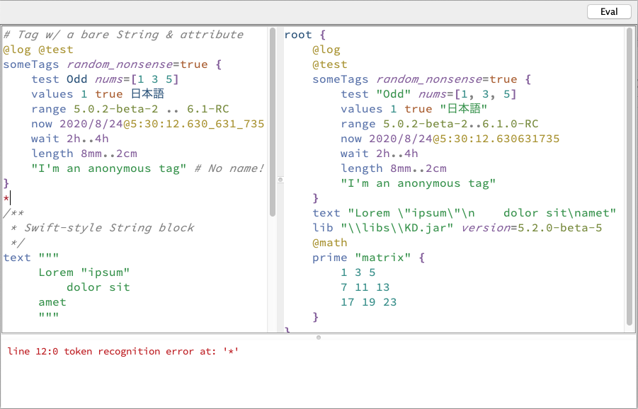

# KDPad
Simple KD GUI Tool

This is a simple [KD](https://github.com/kixi-io/Ki.Docs/wiki/Ki-Data-(KD)) Swing client that allows you to enter and parse KD. It currently supports rudimentary syntax highlighting and error output.

</img>
